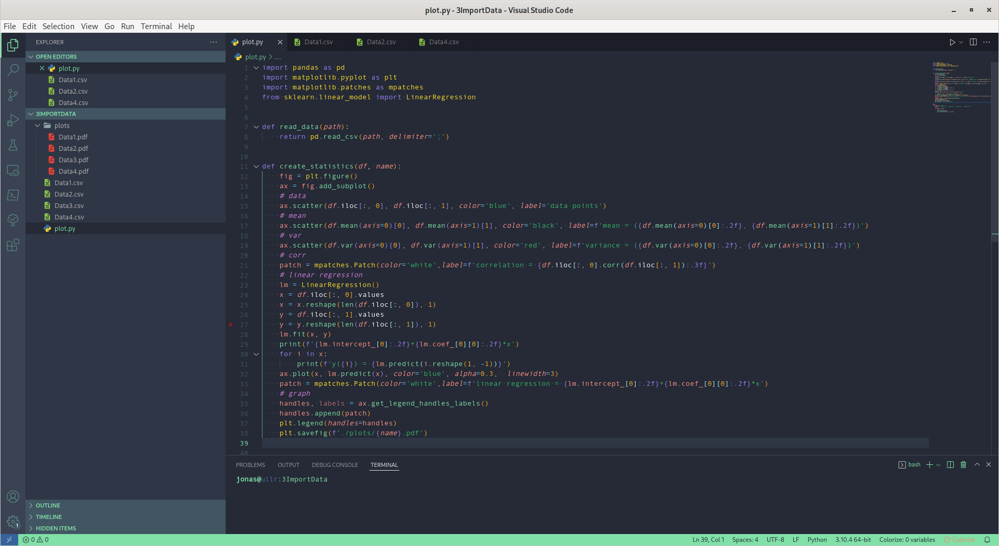
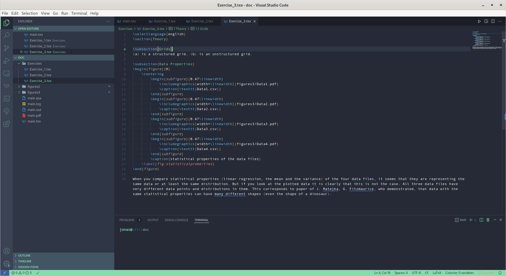

# SuperuserKAM - VS Code Theme

This Color Theme was original only a [terminal theme](https://github.com/JSchmiegel/ColorSchemeSuperuserKAM) to match with the `SuperuserKAM` keycap design by [FreshFromTheGrave](https://geekhack.org/index.php?topic=108326.0%3Futm_source%3Dkeycapsets). Due to the fact, that VS Code is currently my main IDE, I wanted the theme not only in my terminal but also adopted it for VS Code.

## Installation
You can easily find the theme on the marketplace for VS Code.

## Terminal Theme
If you are excited about the theme, you can find a terminal theme for [iTerm2](https://github.com/JSchmiegel/SuperuserKAM-TerminalTheme/wiki/Installation-Guide:-iTerm2), [Windows Terminal](https://github.com/JSchmiegel/SuperuserKAM-TerminalTheme/wiki/Installation-Guide:-Windows-Terminal) and [Gnome Terminal](https://github.com/JSchmiegel/SuperuserKAM-TerminalTheme/wiki/Installation-Guide:-Gnome-Terminal) in the following repository: [SuperuserKAM-TerminalTheme](https://github.com/JSchmiegel/ColorSchemeSuperuserKAM)

## Open for suggestions and improvements
If you have any suggestions for improvements or even want to participate on the theme by adding a semantic highlighting I am open for any pull requests.